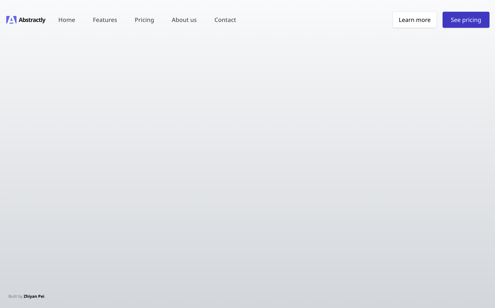
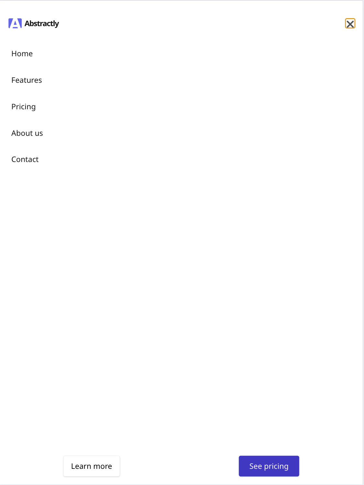
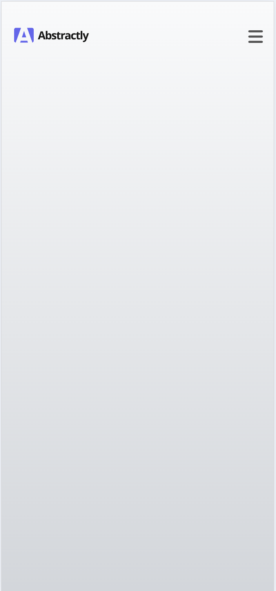
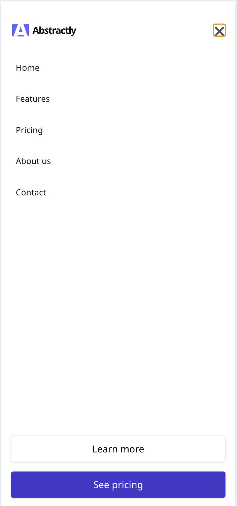

<!-- Use Ctrl/Cmd + Shift + V in VS Code to preview this Markdown file. -

# Navbar Component

This is a reponsive navbar component created with HTML, CSS, JavaScript and Tailwind.

## desktop

## Tablet

### Tablet(Open)

## Mobile

### Mobile (Open)

